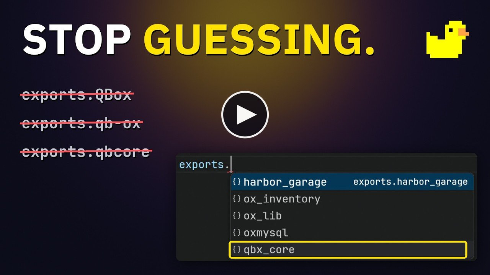

<p align="center">
  
</p>

<h1 align="center">Qbox Lua</h1>

<p align="center">CfxLua language tools for FiveM resource development.</p>

<p align="center">
  <a href="https://marketplace.visualstudio.com/items?itemName=Qbox.qbx-lua">Install from VS Code Marketplace</a>
  · <a href="https://github.com/Qbox-project/qbx-editor/releases">Release notes</a>
  · <a href="https://github.com/Qbox-project/qbx-editor/issues">Report an issue</a>
</p>

Write Lua resources with native completion, diagnostics, formatting and navigation
in one extension. Qbox Lua understands CfxLua syntax and reads `fxmanifest.lua` to
track client, server and shared scripts, resource dependencies, exports and events.

The language server is included. You can work on a single resource or an entire
`resources` folder, without installing Rust or a separate language server.

<p align="center">
  <a href="https://youtu.be/n_x_N1LN3cc">
    
  </a>
</p>

## Built for resource development

| Feature | What it helps you do |
| --- | --- |
| Completion and hover | Look up FiveM natives, runtime globals, exports and LuaCATS types as you write. |
| Control and flag IDs | Hover a native's numeric control or ped configuration flag argument for its documented name and reference. |
| FiveM reference tab | Search natives, controls and ped flags, read documentation and insert Lua calls or IDs. |
| Diagnostics and quick fixes | Find Lua mistakes, missing manifest imports and event/export mismatches in the Problems panel. |
| Client/server context | Catch calls used on the wrong side and see the current file's side in the status bar. |
| Navigation and rename | Follow definitions and references across your workspace and rename supported symbols. |
| Formatting | Format Lua with shared project settings in `qbxlint.toml`. |
| Syntax and editor hints | Read CfxLua backtick hashes, LuaCATS annotations, semantic highlighting, signature help and parameter hints. |
| Framework callbacks | Complete QB-Core/ESX callback names, find server handlers and see payload hints from local Lua code. |
| Snippet browser | Preview and insert Lua recipes, manifest templates, and personal or workspace snippets. |
| Resource wizard | Preview and create a new resource from a plain Lua, ox_lib or Qbox starter. |
| Resource Details | Inspect file counts, events, exports and resource dependencies in an editor tab. |
| NUI preview | Preview a local built UI, send JSON messages, mock callback responses and open Lua handlers. |
| Runtime log viewer | Follow a selected server log, filter recent output and open Lua stack traces in the editor. |
| Workspace health | Check language-server availability, duplicate resource names and unresolved indexed dependencies. |
| Lua utilities | Calculate joaat hashes, pick RGB/hex colors, and convert JSON into an editable Lua table. |
| Resource assets | Browse files, preview supported media and GTA textures, and inspect asset references and manifest issues. |
| Coding assistant tools | Query resource information, diagnostics, symbol references and FiveM documentation through VS Code or MCP. |

Analysis comes from [qbx-lua-ls](https://github.com/Qbox-project/qbx-lua-ls) and
[qbx-lint](https://github.com/Qbox-project/qbx-lint). The editor and command-line
linter share rule configuration, so your local feedback and CI checks can agree.

## Get started

1. Install **Qbox Lua - CfxLua & FiveM** from the
   [VS Code Marketplace](https://marketplace.visualstudio.com/items?itemName=Qbox.qbx-lua).
2. Open a resource folder containing `fxmanifest.lua`, or your server's `resources` folder.
3. Open a Lua file. Disable other Lua language-server extensions for that workspace
   if they produce duplicate diagnostics or completions.

Resources referenced by the manifest and located beside the open resource are
found automatically. If a dependency lives elsewhere, add its folder to
`qbxLua.library` in VS Code settings:

```json
{
  "qbxLua.library": [
    "/path/to/server/resources/[ox]/ox_lib",
    "/path/to/server/resources/[qbx]/qbx_core"
  ]
}
```

This extension runs in your editor. It does not need to be added to `server.cfg`
or started as a FiveM resource.

## Framework callback navigation

QB-Core's `Functions.CreateCallback` / `Functions.TriggerCallback` and ESX's
`RegisterServerCallback` / `TriggerServerCallback` use locally indexed server
registrations for callback-name completion and **Go to Definition**. Signature
help and parameter hints show the payload after the handler's `source` and `cb`
parameters. LuaCATS annotations on local handler functions supply their types.

Use the normal framework export initialization, including local aliases:

```lua
local Core = exports['qb-core']:GetCoreObject()
Core.Functions.TriggerCallback('garage:lookup', function(result)
    -- Use the response here.
end, 'central')
```

The adapters recognize framework imports and exports rather than relying on a
variable's name. ESX's `@es_extended/imports.lua` is supported too. Client/server
manifest entries and `IsDuplicityVersion()` guards establish the call's side.
Callback names must be literal strings, and the server handler must be available
in the indexed workspace or library. Conflicting handler payloads are omitted
from hints; definitions can still show all matching registrations.

This uses local code without fetching framework documentation. Async response
types, custom wrappers and client-callback/Await variants are outside these
adapters. Existing ox_lib callbacks remain supported.

## Control resources from Explorer

Right-click a resource folder in VS Code's normal Explorer and choose **FiveM →
Start Resource**, **Stop Resource**, **Restart Resource**, or **Open Manifest**.
Your existing folder hierarchy stays in place, including groups such as `[qbx]`
and `[ox]`. Actions appear on folders containing `fxmanifest.lua` or the legacy
`__resource.lua`, and target only that resource. Group folders and nested script
folders are not action targets.

Before the first server action, enter the server's hostname/IP, UDP port and
RCON password. You can also run **FiveM: Configure Resource Connection** from the
Command Palette. The address is saved for the current workspace; the password is
kept in VS Code's secret storage, outside project settings and source files.
**FiveM: Test Resource Connection** verifies a response using an echo command.
**FiveM: Forget Resource Connection** removes the saved address and password.

The server must have `rcon_password` configured and its RCON UDP port reachable
from the extension host. Use the game server's UDP port (usually `30120`), not
txAdmin's web port. FiveM RCON transmits the password without encryption; use it
over localhost or a trusted network/tunnel. Passwords containing whitespace or
control characters cannot be used by this client. See the
[Cfx server commands reference](https://docs.fivem.net/docs/server-manual/server-commands/#rcon_password-password).

Commands and server replies appear in **Output → Qbox Lua Resources**. A saved
connection is not a claim that the server is online. If a reply times out, the
command may already have run; it is never retried automatically. Cancelling only
stops waiting for the response. RCON output is command response text, not a live
server log stream or a resource-state monitor.

Resource names must match the connected server. Duplicate names in the workspace
are rejected because RCON identifies resources by name, not by local path. Names
containing spaces or console syntax are also rejected. `start` starts a stopped
resource; `restart` restarts an already running one. Newly added resources need
the server's `refresh` command before they become available. The extension does
not upload files, start FXServer itself, or automatically restart on save.

Discovery follows manifest and folder creation, renaming and deletion, supports
multiple workspace roots, and excludes `node_modules`, `.git`, `vendor` and
`.vscode-test`. Runtime actions require a trusted workspace. In Remote SSH/WSL,
the connection originates from the remote extension host; virtual filesystem
workspaces are not supported for resource controls.

## Follow runtime logs

Run **FiveM: Open Runtime Log** from the Command Palette and select an FXServer or
txAdmin UTF-8 log file accessible to the VS Code extension host. The tab follows
new output, including file rotation and truncation. Filter by text or resource
name, pause/resume, toggle autoscroll, or clear the displayed history.

Recognized Lua traces such as `@my_resource/server/main.lua:42` link to files inside
discovered workspace resources. Duplicate resource names prompt for a folder;
unavailable files are reported when opened. Runtime-internal paths and resources
outside workspace discovery remain plain text.

The viewer retains at most 1,000 lines and 512 KiB of text, with 8,192 characters
per line, and displays the latest 300 matching lines. Initial reads and large
catch-ups use a bounded recent suffix and report skipped output. **Clear view**
does not modify the log file. Closing the tab stops following the file and drops
its history; no log contents or selected path are persisted by the extension.
This feature reads a selected file and does not connect to txAdmin or stream RCON.

## Check workspace health

Run **FiveM: Workspace Health** to check the language-server connection and its
current indexed resources. The tab reports duplicate resource names, missing
dependency/import targets and ambiguous names, with manifest links and searchable
issue lists. Separate paths identify resources sharing a name.

Choose **Refresh** to request a new snapshot. Save manifest changes first; normal
file watches or **Qbox Lua: Reindex Workspace** update index membership. A missing
indexed dependency can be outside configured folders or excluded from analysis.
The report does not verify a running server, individual imported files, computed
dependency names, runtime constraints, or replacement aliases from `provide`.
If the language server is unavailable, the tab shows that failure and offers its
output channel instead of claiming the workspace passed its checks.

Both runtime tools load on demand, reuse local files or the existing index, and
require no additional service or package dependency.

## Inspect resource relationships

Right-click a resource folder and choose **FiveM → Resource Details**, or run
**FiveM: Resource Details** from the Command Palette and choose a resource.
The tab shows indexed Lua file counts by client/server/shared/module context,
registered events and callbacks, exports, dependencies and dependents.
Search the event/export list and open a declaration at its source line.

The small diagram reads **dependents → selected resource → dependencies**.
Resource links switch the same tab to the linked resource. Missing and ambiguous
dependencies are labeled; duplicate names retain separate folder paths so you can
choose the intended resource. These relationships come from manifest dependencies
and script imports, not a live running-server state.

Choose **Refresh** to reload the current index snapshot. Unsaved Lua edits are
included; save manifest changes before refreshing their file counts or dependencies.
Counts cover indexed files and declarations, with notes for incomplete data and
display limits. Dynamic registrations and encrypted content may be unavailable.

The tab loads on demand, reuses the existing index and Explorer discovery, and
keeps your folder hierarchy intact. It requires no additional dependency or service.

## Preview a NUI interface

In a trusted workspace, right-click a resource folder and choose **FiveM → Open
NUI Preview**, or run **FiveM: Open NUI Preview** from the Command Palette. The
resource needs a literal, local HTML `ui_page`, such as `web/dist/index.html`.
Build the frontend first, using a relative asset base such as `./`, then use
**Reload preview** after subsequent builds. **Choose resource…** switches resources
in the same tab.

Enter the payload your UI expects under **Message**, then choose **Send message**.
Under **Mock responses**, enter a JSON object whose keys are callback names and
whose values are their responses, then choose **Apply mocks**. **Callback activity**
shows recent requests and responses; **Open Lua handler** and the searchable
**Lua callbacks** list open matching indexed handlers.

Use a **Preset name** and **Save** to keep both JSON fields for that resource in
the current workspace. Loading a preset fills the fields without sending or
applying them; **Delete** explicitly removes it. Presets are extension workspace
state, not project files.

The preview runs browser UI scripts without a game runtime or Lua execution.
Assets must be in the local UI directory; external/CDN URLs, game assets and
other resources' assets are unsupported. A page's existing Content Security
Policy can also prevent it from loading or starting the preview bridge. See the
[NUI preview guide](docs/nui-preview.md) for examples and troubleshooting.

## Use Lua utilities

Run **Qbox Lua: Open Lua Utilities** to calculate joaat hashes in hexadecimal,
signed or unsigned form, convert RGB/hex colors, or turn JSON into a Lua table.
Each utility has explicit copy and insertion actions. The tab shows the Lua file
that will receive inserted text; focus another Lua editor to change it.

JSON conversion preserves integer text, quotes Lua keys safely and uses
`json.null` for null values by default. Review or edit the output before inserting
it. All calculations run locally. See the [Lua utilities guide](docs/lua-utilities.md)
for supported inputs and conversion choices.

## Browse resource assets

Right-click a resource folder and choose **FiveM → Browse Resource Assets**, or
run **FiveM: Browse Resource Assets** from the Command Palette. Search its asset
inventory, select a file for format information and supported previews, and open
the Lua or manifest locations that refer to it. Refresh after changing files.

Supported previews include common browser media, DDS textures and supported
Legacy/Gen9 RSC7 YTD texture dictionaries. Texture and mip choices decode only the
selected image. Other GTA containers show available metadata; unsupported or
encrypted formats are identified explicitly. The browser also checks literal
manifest declarations and explains incomplete scan coverage. See the
[asset guide](docs/assets.md) for format support, limits and health checks.

## Connect coding assistants

Seven read-only tools expose resource discovery/details, workspace health, Lua
diagnostics, symbol references and bundled FiveM reference search/details.
VS Code versions with the Language Model Tool API can use them from the agent
tool picker. Other clients can launch the bundled MCP stdio server with Node and
explicit workspace folders; extensions can use the versioned public API.

Run **FiveM: Show Coding Assistant Setup** for the [setup guide](docs/assistant-tools.md).
The tools include partial-result notes and an explicit index refresh option after
saved-file changes. VS Code tools use current editor buffers; portable MCP reads
saved files. Tool results describe local static analysis and reference data.

## Create a resource

Run **FiveM: Create Resource** from the Command Palette, or right-click the
destination parent folder in Explorer and choose **FiveM: Create Resource**.
Choose a resource name and a **Plain Lua**, **Lua + ox_lib**, or **Qbox** starter.
The wizard opens a read-only editor preview of the destination and all four files:

```text
my_resource/
    fxmanifest.lua
    shared/config.lua
    client/main.lua
    server/main.lua
```

You can read and scroll the preview while the final picker stays open. Choose
**Create resource** when ready, change the name/starter/folder, or cancel. The
manifest opens after creation. Names can contain 1–64 ASCII letters, numbers,
underscores or hyphens; Windows device names are rejected.

The destination must be an existing folder on the extension host filesystem.
Groups such as `[local]` work, and the folder picker supports multiple workspace
roots. In Remote SSH/WSL, creation happens on the remote extension host. Choose
a parent outside any existing resource; the wizard rejects nested resources and
any existing destination, including an empty folder. If a write fails, cleanup
removes only unchanged files created by that attempt and preserves other content.

The ox_lib and Qbox starters declare their imports and dependencies. Those
dependencies must already be installed on your server. Generated entry files are
empty except for guidance comments, and shared configuration starts with an
empty `Config` table. See the [template maintenance notes](docs/resource-templates.md)
for the exact imports and source references. Creating a resource does not change
`server.cfg` or start it on a server.

Templates are bundled and work offline. The wizard is loaded from a separate
small JavaScript bundle when invoked; it adds no startup scan or watcher.

## Look up control and ped flag IDs

Hover `38` in `IsControlJustPressed(0, 38)` to see `INPUT_PICKUP`, its default
QWERTY binding **E** and Xbox binding **LB**, with a link to the Cfx reference.
Bindings are defaults; player remapping can change them.

Numeric flag arguments in `SetPedConfigFlag` and `GetPedConfigFlag` show their
documented flag names. Where the source only names a flag, the hover says that its
behavior is not documented. The references are bundled and work offline; opening
a source link requires a connection.

These hovers recognize the native and argument position. Variables, calculated
expressions, unknown IDs and functions that shadow a native do not receive an
ID reference tooltip.

## Browse the FiveM reference

Run **Qbox Lua: Open FiveM Reference** from the Command Palette to open a reference
tab beside your code. Search native names or hashes, control names or IDs, default
bindings, and ped configuration flag names or IDs. Native results can be filtered
by namespace and availability on the client, server or both.

Select a result to read its signature, parameters, return values and documentation,
or the control/flag reference. Copy its name, hash or ID, open its source, or insert
a Lua call with parameter placeholders or an ID into the Lua editor identified in
the tab. Open or focus a Lua file to choose an insertion target.

The tab loads on demand, pages results, and reuses the bundled data used by hovers.
Searching and reading work offline. Source links open in your browser. If the
language server is unavailable, restart it and retry from the tab.

## Browse and save Lua snippets

Run **Qbox Lua: Open Snippet Browser** (or **Show Snippets**) to open **FiveM
Snippets** beside your code. Search the existing Lua recipes, manifest templates
and your saved snippets by name, prefix, description or code. Filter by source,
preview the body, then insert it into the Lua editor named in the tab. **Copy
snippet** copies the exact snippet syntax, including placeholders.

Choose **New snippet** to add an editable starter, or **Duplicate** to customize
an existing recipe. Select Lua code and right-click **Qbox Lua: Save Selection as
Snippet** to save it literally, including dollar signs and backslashes. Each
action lets you choose a personal library or a workspace folder. Personal
snippets live in the extension's user storage and are available across projects
on that extension host. Workspace snippets live in
`.vscode/qbx-lua-snippets.json` at the chosen root, so you can commit and share them.

Use **Manage JSON** in the tab, **Edit Personal Snippets**, or **Edit Workspace
Snippets** to edit names, descriptions, search prefixes and code. Files accept
JSON comments and trailing commas. Entries use the familiar VS Code snippet
fields; `body` can be a string or an array of lines:

```json
{
  "My event handler": {
    "prefix": "my-event",
    "description": "Handle a resource event",
    "body": [
      "AddEventHandler('${1:resource}:${2:event}', function()",
      "\t$0",
      "end)"
    ]
  }
}
```

Insertion supports [VS Code's snippet placeholders and variables](https://code.visualstudio.com/docs/editing/userdefinedsnippets#_snippet-syntax).
Custom snippets are available through this browser; their prefixes are search
terms here and do not add completion suggestions. JSON edits refresh
the library. If one file has errors, the tab reports them while keeping other
libraries available. Adding a snippet preserves comments and refuses duplicate
names or unsaved JSON edits. The browser loads on demand; custom and manifest
snippets remain available when the language server is stopped.
Each library is limited to 1 MiB and 1,000 snippets; each snippet body can use up
to 128 KiB.

## Supported environments

- VS Code 1.85 or newer on **Windows x64**, **Linux x64/ARM64**, and **macOS x64/ARM64**.
- FiveM / GTA V resources using CfxLua, including client, server and shared scripts.
- Qbox-specific checks are included; the Lua and FiveM tooling also works with resources
  that do not use Qbox.

**RedM:** the manifest completion includes `rdr3`, but the bundled native database
targets FiveM and currently excludes RedM-specific natives. Full RedM language
support is not advertised. Dynamic code, encrypted scripts and dependencies outside
the indexed workspace can also limit analysis.

## Project configuration

Add `qbxlint.toml` to your workspace to share lint and formatting preferences with
the [qbx-lint CLI and GitHub Action](https://github.com/Qbox-project/qbx-lint).
For example:

```toml
exclude = ["web/**", "**/vendor/**"]
ignore_diagnostics = ['\[standalone\]/']

[rules]
"unused-argument" = "off"

[format]
indent_width = 4
use_tabs = false
quote_style = "preserve"
```

`exclude` removes files from analysis entirely. `ignore_diagnostics` takes gitignore-style
patterns for code you don't maintain: those files stay indexed for definitions and completion,
but their problems are hidden.

See the [configuration reference](https://github.com/Qbox-project/qbx-lint/blob/main/docs/reference.md)
and [rule list](https://github.com/Qbox-project/qbx-lint/blob/main/docs/rules.md).

## Editor settings

Search for `qbxLua` in VS Code Settings.

| Setting | Default | Description |
| --- | --- | --- |
| `qbxLua.library` | `[]` | Extra dependency folders to index. |
| `qbxLua.diagnostics.enable` | `true` | Show diagnostics. |
| `qbxLua.diagnostics.workspace` | `true` | Include files that are not open. |
| `qbxLua.diagnostics.rules` | `{}` | Override rule levels: `off`, `hint`, `info`, `warning` or `error`. |
| `qbxLua.inlayHints.enable` | `true` | Show parameter names beside literal arguments. |
| `qbxLua.semanticTokens.enable` | `true` | Enable semantic highlighting. |
| `qbxLua.warnAboutOtherLuaExtensions` | `true` | Warn about other active Lua language servers. |
| `qbxLua.server.path` | `""` | Advanced: use a custom language-server binary. |
| `qbxLua.trace.server` | `"off"` | Advanced: trace language-server communication with `messages` or `verbose`. |

## Commands and troubleshooting

Open the Command Palette and search for **Qbox Lua**:

- **Open Snippet Browser** and **Show Snippets** open the recipe and custom snippet tab.
- **Save Selection as Snippet** saves selected Lua code to a personal or workspace library.
- **Edit Personal Snippets** and **Edit Workspace Snippets** open the editable JSON libraries.
- **Open FiveM Reference** opens the searchable native, control and ped flag reference.
- **Open Lua Utilities** opens hashes, colors and JSON-to-Lua conversion.
- **Show Status** and **Show Output** help diagnose server startup and indexing.
- **Reindex Workspace** refreshes indexed files and manifests.
- **Restart Language Server** also reloads library and workspace configuration.

Search for **FiveM: Create Resource** to open the resource creation wizard.
**FiveM: Browse Resource Assets** opens asset previews and checks;
**FiveM: Show Coding Assistant Setup** opens the VS Code/API/MCP guide.

If a resource dependency is missing from completion or navigation, check that it
is available beside the workspace or included in `qbxLua.library`. When reporting
an issue, include the extension version, operating system and a small reproduction.

## Other editors

The bundled server, `qbx-lua-ls`, is also available as a standalone executable.
The [editor setup guide](https://github.com/Qbox-project/qbx-editor/blob/main/docs/editors.md)
covers the Zed extension in `integrations/zed` and includes Neovim 0.11+ and Helix
configuration examples. None of these has been integration-tested in its editor;
VS Code has an automated integration suite.

Other LSP clients need their own configuration or adapter. The VS Code commands,
status bar and syntax grammars are part of this extension. A JetBrains integration
is not included.

## Manual installation

Marketplace installation selects the matching platform package and supports normal
extension updates. For an offline or manual installation, download your platform's
`.vsix` from [GitHub Releases](https://github.com/Qbox-project/qbx-editor/releases)
and run **Extensions: Install from VSIX** in VS Code.

You can also install from the Marketplace through the terminal:

```sh
code --install-extension qbox.qbx-lua
```

## Development

To build the extension, run its tests or use the Extension Development Host, see
[CONTRIBUTING.md](https://github.com/Qbox-project/qbx-editor/blob/main/CONTRIBUTING.md).

## License

[GPL-3.0-or-later](https://github.com/Qbox-project/qbx-editor/blob/main/LICENSE).
